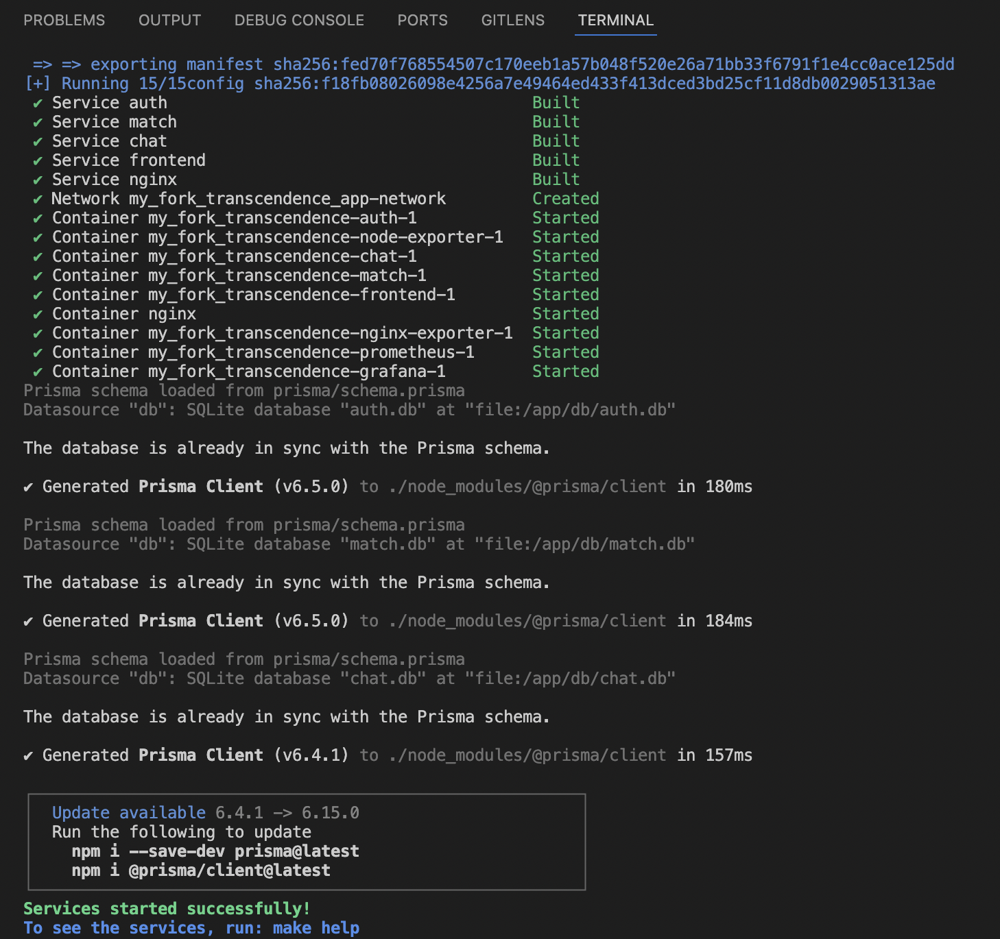

#

# <p align="center">**ft_transcendence**</p>

## <p align="center"> 🕹️ A realtime web-based pong game, _as our graduation project at [42](https://www.42network.org) 🎓_ </p>

### 👥 Team members & collaboration: 
- 🛠️ [Ramy](https://github.com/letsgogeeky): Team & Project Management, Devops, containerization & overall infrastructure 
- 🔐 [Bori](https://github.com/pisakbori): User Management, authentication (2FA & remote), database & microservices for the backend
- 🎮 [Alex](https://github.com/aoprea42): Game component with 3D graphics & AI opponent
- 🎨 [Mary Kate](https://github.com/MaryKateEvan): front-end and overall design across the website
- 💬 [Timo](https://github.com/TimoKillinger): live-chat component (tournament & private chat)

#

## 📝 Description

_The goal of this project is to build a modern web platform for the **legendary Pong game** 🏓 — but with a twist: multiplayer, tournaments, chat, 3D graphics, and even AI opponents."_ 🚀

In simpler words: imagine gathering with friends, entering your nicknames, and playing Pong directly in your browser 🎮 — not only **one-on-one** on the same keyboard, but also **remotely against players online**, or even against a computer-controlled opponent (**AI**) 🤖. The platform keeps track of who plays against whom, organizes **tournaments** 🏆, and lets you **chat live** 💬 while the games unfold.

💻 Behind the scenes, we combined a frontend in **TypeScript + TailwindCSS** with a backend of **microservices** (for authentication, matchmaking, chat, etc.) powered by **Fastify** and **SQLite**. For security, we added **Google login**, **2-Factor Authentication**, and **JWT tokens**, while monitoring is handled through **Prometheus** & **Grafana**. The game itself is enhanced with **3D visuals** (BabylonJS) that give a fresh look to the classic pong.

✨ In its final form, this project is not just “Pong” — it’s _a full multiplayer gaming experience on the web, reimagined with today’s technologies, AI challenges, and 3D design_. ✨ 


## 👀 Preview:


## 🎯 Main Components of the project:


## ⚙️ Installation

1. Clone the repository:

```bash
git clone https://github.com/letsgogeeky/transcendence
```

2. Navigate to the project's directory:

```bash
cd transcendence
```
<!-- [❕ _Make sure you have  [*Docker*](https://www.docker.com) installed, so that you can move on to..._] -->

<div align="center">

[❕ _Make sure you have  [*Docker*](https://www.docker.com) installed, so that you can move on to..._]

</div>

3. Boot everything up with the help of our magic [`Makefile`](Makefile):

```bash
make up
```

> 🏁 _And if everything boots correctly the output should finish as follows:_


## 🚀 Usage

Now you can go to any broswer and access the website by simply typing:


which should serve you the following main page:


❗️ At this point though, you would only be able to see the main pages _(Welcome, Log In & Sign Up pages)_ without being able to actually sign up & access the game.

💁‍♀️ Let's clarify now **WHY**'s that and what you can do to fully browse the website... 💪

#

### 🔑 The importance of the missing SECRETS in the .env file

When you first do `make up` this generates some certificates (`server.crt`, `server.csr`, `server.key`) and the following **`.env`** file:


This `.env file` is considered _"enough"_ for the containers to boot up and the frontend to be accessed at https://localhost. ❗️ However, it uses <span style="color:#9667F0;">placeholder values</span> (_the ones in the purple boxes above_) like `your-secret-key-here`, which means <span style="color:#F54570;">the core functionality (registration, login, SMS, Google OAuth, etc) will not work until they are replaced with **real credentials**.</span> ❗️❗️


<!-- - **Secrets** (`SECRET`, `COOKIE_SECRET`, `REFRESH_SECRET`): You can generate your own with `openssl rand -hex 32`.
- **Google OAuth** (`GOOGLE_ID`, `GOOGLE_SECRET`): You can obtain from Google Cloud Console.
- **Google App Password** (`GOOGLE_PASS`): You can generate from your Google Account → Security → App Passwords.
- **Infobip SMS** (`INFOBIP_ID`, `INFOBIP_TOKEN`, `INFOBIP_SENDER`): You can obtain from your Infobip Dashboard. -->

#### 🔎 Explanation of the necessary Secrets & How they can be obtained:

| Secrets | Functionality | How to Obtain |
|---------|----------------------------|---------------|
| SECRET, <br>COOKIE_SECRET, <br>REFRESH_SECRET | Are used to generate and verify JWTs or **session cookies**. Without real values, authentication tokens will either fail to generate or won’t validate. | You can generate your own with `openssl rand -hex 32`. |
| GOOGLE_PASS, <br>GOOGLE_ID, <br>GOOGLE_SECRET | Are required if the platform supports Google OAuth. Without them, **Google login** won’t work at all. | GOOGLE_ID, GOOGLE_SECRET: Obtain from Google Cloud Console.<br>GOOGLE_PASS: Generate from your Google Account → Security → App Passwords. |
| INFOBIP_ID, <br>INFOBIP_TOKEN, <br>INFOBIP_SENDER | Are for SMS verification (or similar). Without them, **phone-based 2FA** or notifications won’t work. | You can obtain from your Infobip Dashboard. |

<br>

✨ Once you get those 9 values, you can add them in the `.env` (_replacing the current placeholder values_), then you do `make up` again, and now you have the fully working website, where you can sign up and log in to play the game and access all features 🥳 🎉 (_as shown in the [Main Components of the project](https://github.com/MaryKateEvan/transcendence?tab=readme-ov-file#-main-components-of-the-project) section above_).

### 🧭 USER JOURNEY


## 🛠️ Some more technical Info

For more detailed information regarding the infrastructure and **core application services**, check [here](./docs/SERVICES.md) 👈 🔍

## 🙌 &nbsp;Acknowledgements

