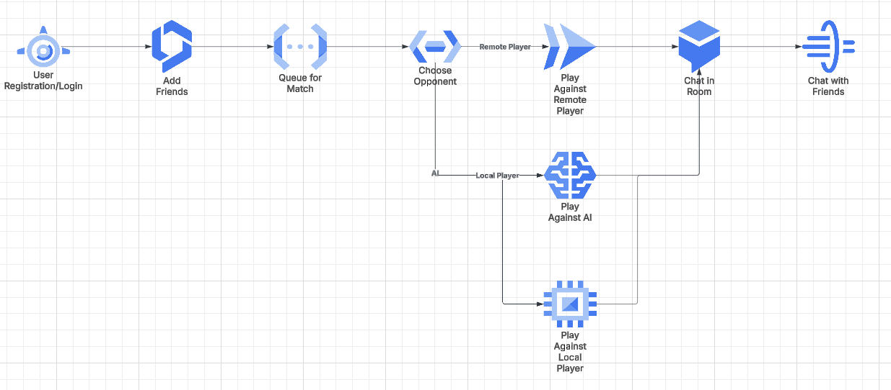

# Transcendence on steroids

## How to run
- To start the platform, run `make up`
- To stop the platform, run `make down`
- To restart the platform, run `make restart`
- To check the logs, run `make logs`
- To generate the certificates, run `make generate-certs`
- To stop the platform and remove the containers, run `make clean`

## Navigate to the platform
- The platform is available at `https://localhost`
- Grafana is available at `http://localhost:3001`
- Prometheus is available at `http://localhost:9090`
- Node Exporter is available at `http://localhost:9100/metrics`
- Nginx Exporter is available at `http://localhost:9113/metrics`

## API Documentation
- Chat API docs is available at `https://localhost/chat/docs`
- Match API docs is available at `https://localhost/match/docs`

### User Journey

### Decision records
- **Use the new subject** Fastify is a good lightweight and flexible framework.
- **Backend as Microservices** We have a good opportunity to build each backend component independently since we're using SQLite. (User Management, Match Making System, Real-time server for gaming, live chat, etc..) each one of these components can be built independently.

### Pong Platform user journeys and description

#### Platform pages
- SignIn
- SignUp
- Profile (Match history, Name, Avatar)
- Home (Queue up for a match, See online friends and players)
- Match (Play against AI, Same machine player, OR remote players)
- Chat (See chat history, see history of specific chat with a specific player, send and see messages)
- Search (can search other players and add them as friends or view their profile)
- Tournaments (View tournaments, join a tournament, create a tournament)

#### User / Player and Friend Management
- User can sign up with email and password
- User can sign in with email and password
- User can sign out
- User can reset password
- User can update password
- User can sign in with Google
- User can Update their profile information including profile picture (Avatar)
- User can view other users' profile information
- User can search for other users
- User can send friend requests to other users
- User can accept or reject friend requests
- User can unfriend other users

#### Match Making System
- User can create a match
- User can join a match
- User can leave a match
- User can view other users' match history
- User can view other users' match stats
- User can view other users' match achievements

#### Game
- User can see in real-time the game and the other players
- User can chat with other players
- User can see the game stats (score, etc..)
- User can leave the game at any time
- User can play in different modes (1v1, 2v2, 3v3, etc..)
- Opponents can be:
    - Other player on the same device using different keyboard keys
    - AI (pre-defined level of difficulty)
    - Other players on different devices (using the same keyboard keys)

#### Tournaments
- User can create a tournament
- User can join a tournament
- User can leave a tournament
- User can view other users' tournament history
- User can view other users' tournament stats
- User can view other users' tournament achievements

#### In-Game socket communication
- User can send paddle move to the server
- User can receive paddle move from the server
- User can send ball move to the server
- User can receive ball move from the server
- User can see the game stats (score, etc..)
- User can see when the game starts and when it ends

### Subject modules
- Major module: Use a framework to build the backend. (fastify)
- Minor module: Use a framework or toolkit to build the front-end. (TailwindCSS)
- Minor module: Use a database for the backend -and more. (SQLite)
- Major module: Standard user management, authentication and users across tournaments. (Auth)
- Major module: Implement remote authentication. (Google Auth)
- Major module: Remote players (socket.io) **To be tested.**
- Major module: Multiple players (socket.io, multiple clients) **To be tested.**
- Major module: Live Chat. (socket.io) **To be tested. and continue feature-set required**
- Major module: Implement Two-Factor Authentication (2FA) and JWT. (Auth + SQLite + fastify-jwt)
- Minor module: Monitoring system. (Prometheus, Grafana, Node Exporter, Nginx Exporter)
- Major module: Designing the Backend as Microservices. (Auth, Match, Chat)
- Major module: Implementing Advanced 3D Techniques. (BabylonJS)

Count of Major modules: 9
Count of Minor modules: 3

Total: 10.5

## Services Configuration

### Core Application Services

#### Auth Service
- **Location**: `./backend/auth`
- **Port**: 8081
- **Protocol**: HTTP
- **Database**: SQLite at `/app/db/auth.db`

#### Match Service
- **Location**: `./backend/match`
- **Port**: 8082
- **Protocol**: HTTP
- **Database**: SQLite at `/app/db/match.db`

#### Chat Service
- **Location**: `./backend/chat`
- **Port**: 8083
- **Protocol**: HTTP
- **Database**: SQLite at `/app/db/chat.db`

#### Frontend Service
- **Location**: `./frontend`
- **Port**: 3000
- **Protocol**: HTTP

### Infrastructure Services

#### Nginx
- **Location**: `./infra/nginx`
- **Ports**:
  - 80 (HTTP)
  - 443 (HTTPS)
- **Protocol**: HTTP/HTTPS

#### Nginx Exporter
- **Image**: `nginx/nginx-prometheus-exporter`
- **Port**: 9113
- **Protocol**: HTTP

#### Node Exporter
- **Image**: `prom/node-exporter`
- **Port**: 9100
- **Protocol**: HTTP

#### Prometheus
- **Image**: `prom/prometheus`
- **Port**: 9090
- **Protocol**: HTTP

#### Grafana
- **Image**: `grafana/grafana`
- **Port**: 3001
- **Protocol**: HTTP

### Network Configuration
All services are connected through a bridge network named `app-network`

### Volume Mounts
Common volumes shared across services:
- `./certs` (SSL certificates)
- `./uploads` (file storage)
- `./db` (database files)

Each service has its own source code mounted from its respective directory
